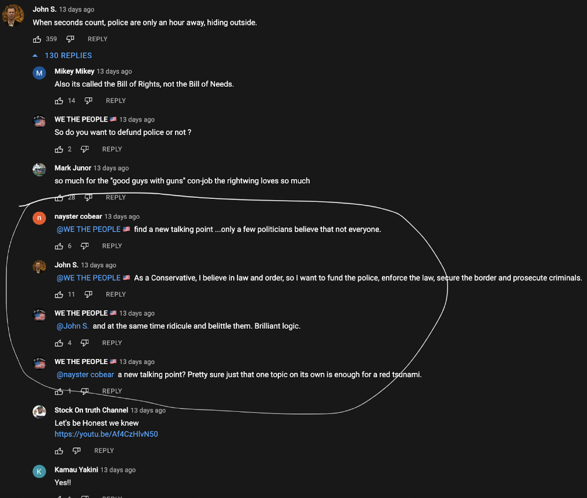
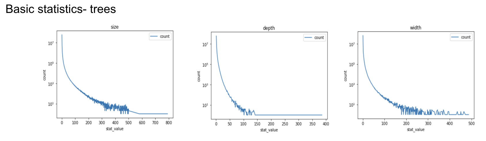
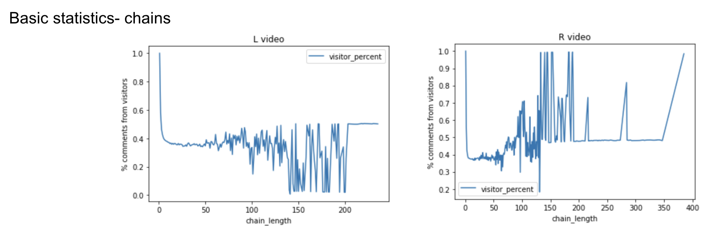
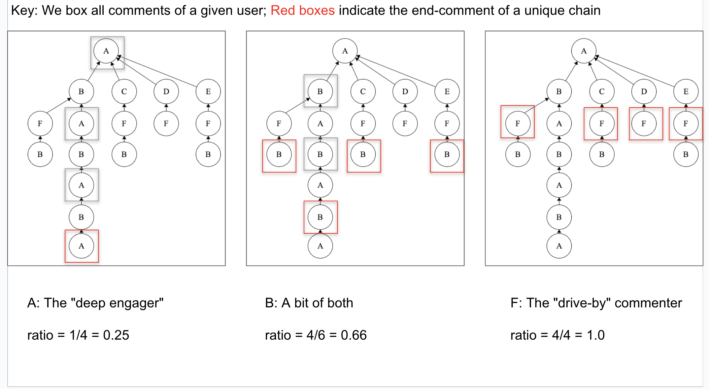
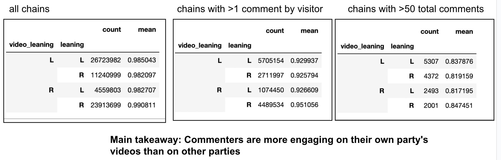

# youtube-conversations
Analyzing conversations from YouTube comments

## Project Overview

What is the structure of cross-partisan conversations on YouTube? 
We analyze over 134M comments on 274K YouTube videos to understand this.

We first generate "trees" of conversations by using @-replies as relations between parent and child-nodes.
We find that most conversation trees are under 300 nodes in size, 100 in depth, and 200 in width.

Next, we identify unique "chains" of conversations- back-and-forth replies between the same two users within the same tree).
We also find that most chains are made up of at least 40% "visitors", or commentors from the political ideology opposite that of the video being watched.

Next, we deevelop and define the "comment spread ratio" as a measure of how "spread out" one's comments are across different conversation chains.
A high ratio represents high spread of comments.
A low ratio represents low spread, and therefore deep engagement.

Here we find that commenters are more engaging on their own party's videos than on other parties.

